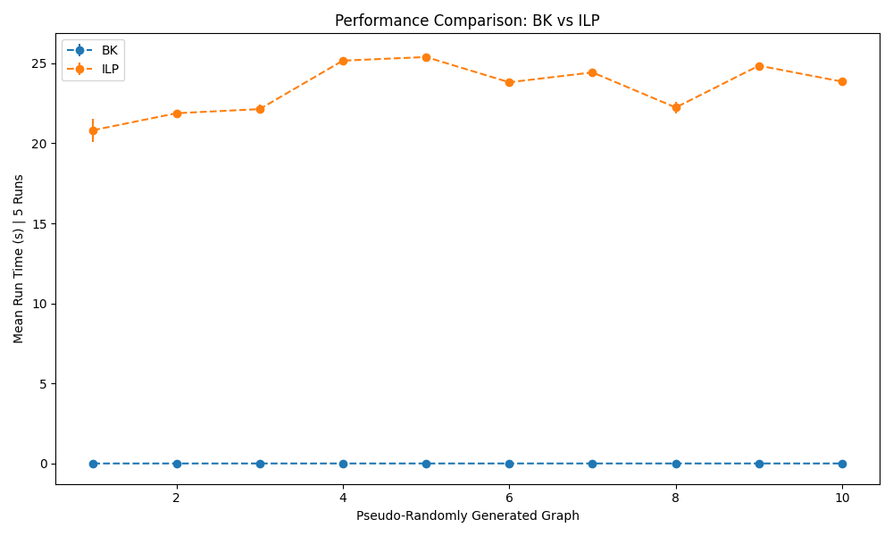

# CS581-HW7

## Requirements

- Python 3.x

Required Python modules:

- networkx
- gurobipy

## Usage

```
python3 rsa.py p1 p2 m
```

```
python3 bron-kerbosch.py graph.txt
```

```
python3 ilp.py graph.txt
```

## Results

### RSA

The average runtime of my rsa method was 0.55(s)

### BK vs. ILP
Both algorithms were run on each graph 5 times. Gurobi was used with 16 cores on my local machine. 



## Testing

To get a valid p and q pair
```
python3 rsa.py --generate
```

To run 10 tests and verify them
```
python3 rsa.py --test
```

Generate a valid graph using networkx
```
python3 ilp.py --generate
```

Generate 10 graphs and test bk vs ilp
```
python3 ilp.py --test
```
